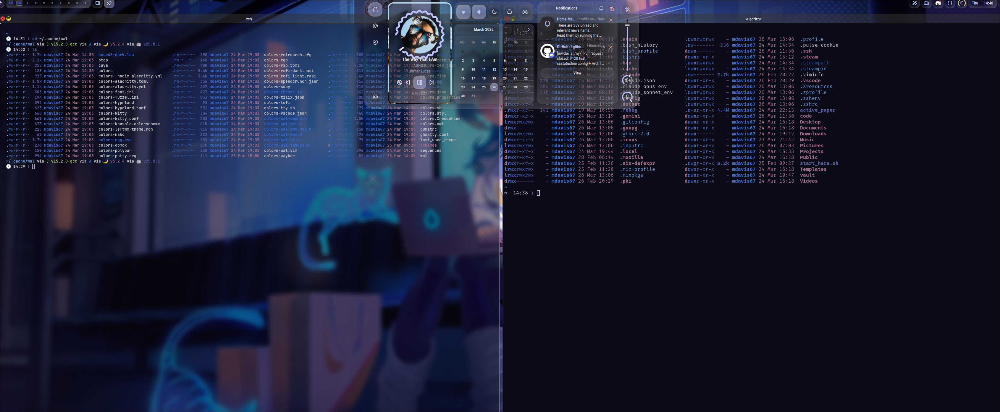
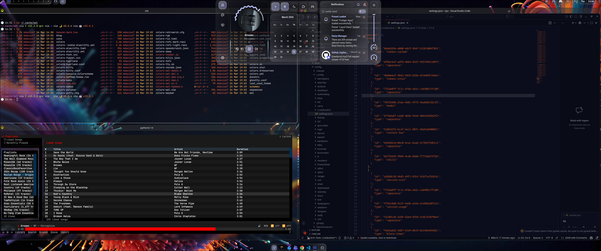
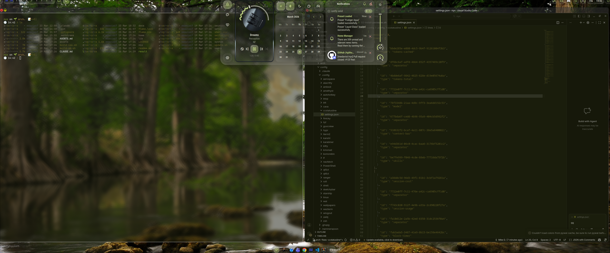
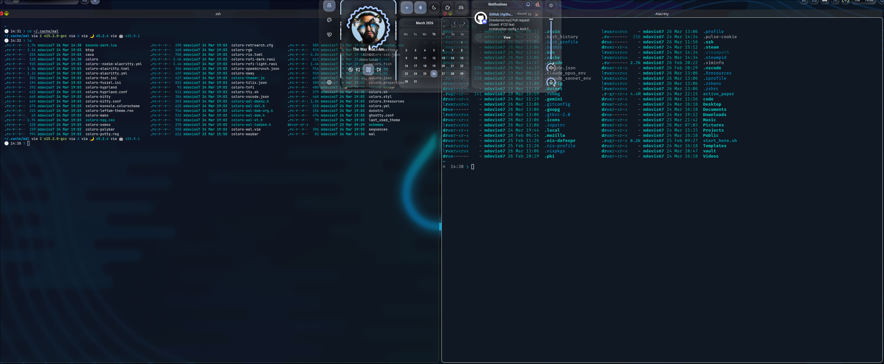
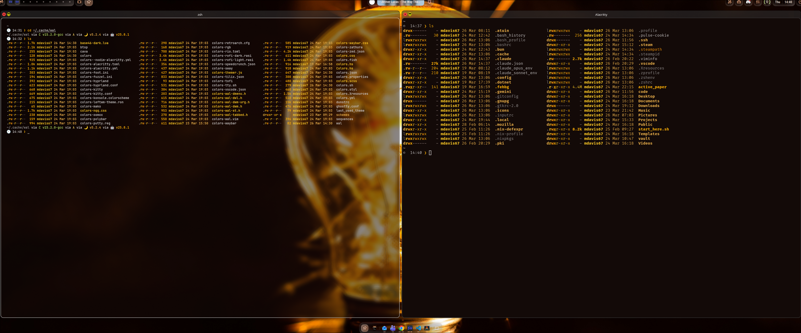
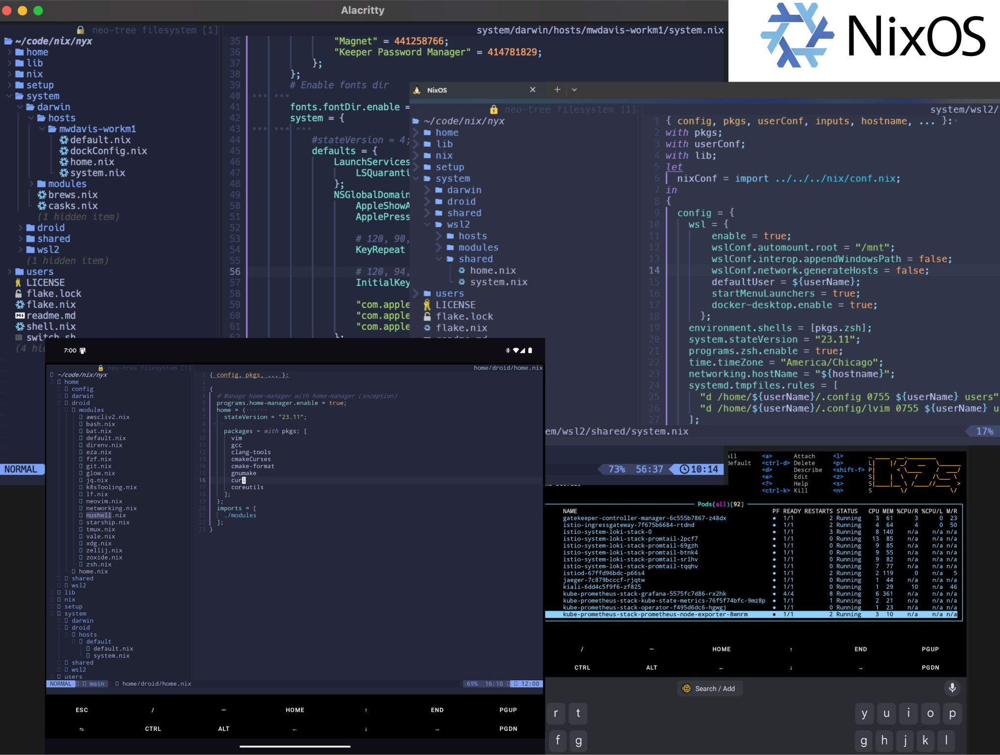

# Nyx

Personal multi-platform [Nix Flakes](https://nixos.wiki/wiki/Flakes) configuration managing system and user environments across NixOS, macOS (Darwin), Arch Linux, WSL2, and Android.

## Desktop — Hyprland + Quickshell



The Linux desktop stack is **Hyprland** (compositor) with **[Ambxst](https://github.com/Axenide/Ambxst)** (Quickshell-based desktop environment) providing bar, dock, launcher, notifications, lockscreen, AI assistant, and more. Colors are dynamically generated from wallpapers via **matugen** (Material Design extraction) and exported to pywal format for downstream tools (cava, btop, kitty, neovim).

Switching wallpapers re-themes the entire environment instantly — every UI element pulls its palette from the active wallpaper.

| Vibrant | Forest |
|---|---|
|  |  |

| Minimal | Warm / IDE |
|---|---|
|  |  |

macOS hosts use **Aerospace** (tiling window manager), **Sketchybar** (status bar), **Karabiner** (key remapping), and **Hammerspoon** (automation). Yabai is also available as an alternative tiling WM.

## Multi-platform Shells



## Architecture

### Configuration Layers

```
flake.nix  →  lib/default.nix  →  system/<platform>/  +  home/
                (mkNixSystemConfiguration, mkArchConfiguration, mkHome, mkNixOnDroidConfiguration)
```

**`flake.nix`** is the entry point. It defines all inputs (nixpkgs, home-manager, hyprland, agenix, nix-darwin, nixos-wsl, nix-on-droid, etc.) and maps hostnames to configurations via helper functions in `lib/default.nix`.

**`lib/default.nix`** provides four builder functions:
- `mkNixSystemConfiguration` — NixOS and Darwin (handles `nixos`, `darwin`, `iso`, `vm`, `wsl` build targets)
- `mkArchConfiguration` — standalone home-manager for Arch Linux hosts
- `mkHome` — standalone home-manager configurations
- `mkNixOnDroidConfiguration` — Android configurations

### Directory Structure

```
.
├── home/                    # User-level (home-manager) configuration
│   ├── shared/modules/      # Cross-platform modules
│   │   ├── ai/              # claude, chatgpt, gemini, ollama
│   │   ├── app/             # browsers, terminals, editors, streaming, obs, discord
│   │   ├── desktop/         # hypr, kanshi, rofi, cava, kmonad, vial, gtk
│   │   ├── dev/             # go, rust, python, node, lua, nix, cpp, android
│   │   ├── gaming/          # steam, retroarch
│   │   ├── sdr/             # software-defined radio (readsb, gqrx, sdr++, rtl_433)
│   │   ├── shell/           # zsh, tmux, git, starship, weechat (IRC), nixvim, 60+ tools
│   │   └── theme/           # gtk theming, pywal
│   ├── darwin/modules/      # macOS-specific (aerospace, sketchybar, karabiner, hammerspoon)
│   ├── nixos/               # NixOS-specific home modules
│   ├── arch/                # Arch-specific home modules
│   ├── droid/               # Android-specific home modules
│   └── config/              # Raw dotfiles symlinked into $HOME
├── system/                  # System-level configuration
│   ├── shared/              # Cross-platform profiles, secrets, common modules
│   ├── nixos/               # NixOS (kernel, boot, hardware, hyprland, hyprlogin)
│   │   └── hosts/           # Per-host NixOS configs
│   ├── darwin/              # macOS (yabai, dock, brews, casks)
│   │   └── hosts/           # Per-host Darwin configs
│   ├── arch/                # Arch Linux host configs
│   │   └── hosts/           # Per-host Arch configs
│   └── droid/               # Android system config
├── lib/                     # Builder functions and shared helpers
├── nix/                     # nixpkgs config, overlays, custom packages
├── secrets/                 # age-encrypted secrets (agenix)
├── setup/                   # Platform install/bootstrap scripts
│   ├── arch/                # 3-phase Arch setup + optional streaming setup
│   ├── macos/               # macOS bootstrap
│   ├── wsl/                 # WSL2 bootstrap
│   └── virtual/             # VirtualBox image build
├── users/                   # User profile definitions
└── switch.sh                # Universal rebuild script (auto-detects platform)
```

### Module Toggle Pattern

Hosts configure themselves through the `nyx` option namespace. Each host has a directory under `system/<platform>/hosts/<hostname>/` containing `default.nix` (toggles), `home.nix` (user config), and optionally `system.nix` (hardware).

```nix
nyx = {
  modules = {
    user.home = ./home.nix;
    # Desktop
    desktop.hyprland.enable = true;
    desktop.kanshi.enable = true;
    # AI
    ai.claude.enable = true;
    # Gaming
    gaming.steam.enable = true;
  };
  secrets = {
    userSSHKeys.enable = true;
    userPGPKeys.enable = true;
  };
  profiles = {
    desktop.enable = true;
  };
};
```

Module options are defined in `home/shared/modules/` and applied by home-manager. Profiles live in `system/shared/profiles/` and secrets in `system/shared/secrets/`.

## Hosts

```
system/
├── nixos/hosts/
│   ├── hephaestus/     # Home desktop — i9 / AMD 7900XT / dual-boot NixOS+Win
│   ├── olenos/         # ThinkPad X13 laptop
│   ├── hydra/          # Home lab k3s VM on Proxmox
│   ├── ares/           # Personal WSL2 instance
│   ├── nixos/          # Generic WSL2
│   ├── livecd/         # Bootable installer ISO
│   └── virtualbox/     # VirtualBox OVA image
├── arch/hosts/
│   ├── prometheus/     # Home desktop — Arch + Hyprland
│   └── L242731/        # Work Dell — Arch + Hyprland
├── darwin/hosts/
│   ├── mwdavis-workm1/ # Work MacBook 2022 16" Pro M1
│   └── L241729/        # Work MacBook
└── droid/hosts/
    └── default/        # Google Pixel Fold (Nix-on-Droid)
```

## Getting Started

### Prerequisites

- [Nix](https://nixos.org/download.html) with flakes enabled
- Git

### Quick Start (Existing Host)

```bash
git clone https://github.com/mwdavisii/nyx.git
cd nyx

# Enter dev shell
nix develop

# Apply configuration (auto-detects platform)
./switch.sh
```

### Rebuild Commands

```bash
# Universal (recommended) — detects OS and runs the right thing
./switch.sh

# Manual per-platform
sudo nixos-rebuild switch --show-trace --flake .#<hostname>     # NixOS
sudo darwin-rebuild switch --flake .                             # macOS
setup/arch/02-install-packages.sh --sync                        # Arch (system pkgs)
home-manager switch --show-trace --flake .#<hostname>            # Arch (home-manager)
nix-on-droid switch --show-trace --flake .                       # Android
```

### Validate Without Applying

```bash
nix flake show                                                          # Check outputs
sudo nixos-rebuild dry-build --flake .#<hostname>                       # NixOS dry run
nix build .#nixosConfigurations.<hostname>.config.system.build.toplevel  # Build only
```

### Build Images

```bash
nix build .#nixosConfigurations.livecd.config.system.build.isoImage     # Bootable ISO
nix build .#nixosConfigurations.virtualbox.config.system.build.isoImage # VirtualBox OVA
```

### Update Flake Inputs

```bash
nix flake update            # Update all inputs
nix flake update <input>    # Update a single input (e.g., nixpkgs)
```

## Platform Installation Guides

### NixOS (WSL2)

1. Enable WSL2 — [Microsoft docs](https://learn.microsoft.com/en-us/windows/wsl/install)
2. Install [Git for Windows](https://git-scm.com/downloads)
3. From PowerShell:

```powershell
git clone https://github.com/mwdavisii/nyx.git
Set-Location ./nyx/setup/wsl
./start_here.ps1
```

4. You're now in the NixOS shell. Continue setup:

```bash
cd ./nyx/setup/wsl
./step2.sh
```

5. Edit `flake.nix` and update user details in the appropriate `users/*.nix` file:
   - `displayName`, `email`, `signingKey` (for git config)
   - `windowsUserDirName` (your Windows profile folder name, used for VS Code symlink)

6. Apply final configuration:

```bash
./step3.sh
```

7. Open a new shell. From now on, rebuild with `./switch.sh`.

> **Note:** If you see `\r` errors in step 2, Git may have converted line endings. Re-clone from inside the NixOS shell with `nix-shell -p git && git clone https://github.com/mwdavisii/nyx`.

### Arch Linux

3-phase setup: minimal OS install from archiso, desktop packages, then Nix + home-manager. See [`setup/arch/README.md`](setup/arch/README.md) for the full guide.

```bash
# Phase 1 — from archiso (partitions, base system, reboot)
curl -LO https://raw.githubusercontent.com/mwdavisii/nyx/main/setup/arch/01-install.sh
chmod +x 01-install.sh && ./01-install.sh

# Phase 2 — after first login (desktop packages, idempotent)
curl -LO https://raw.githubusercontent.com/mwdavisii/nyx/main/setup/arch/02-install-packages.sh
chmod +x 02-install-packages.sh && ./02-install-packages.sh

# Phase 3 — Nix + home-manager bootstrap
curl -LO https://raw.githubusercontent.com/mwdavisii/nyx/main/setup/arch/03-setup-nix.sh
chmod +x 03-setup-nix.sh && ./03-setup-nix.sh
```

Optional streaming setup (OBS, audio routing):

```bash
setup/arch/optional-streaming-setup.sh
```

After initial setup, `./switch.sh` syncs system packages and applies home-manager.

### macOS

1. Install [Git](https://git-scm.com/downloads)
2. Clone and bootstrap:

```bash
git clone https://github.com/mwdavisii/nyx.git
cd nyx/setup/macos
./start_here.sh
```

3. Copy `users/mwdavisii.nix` to a file with your username and update `displayName`, `email`, and `signingKey`.

4. Edit `flake.nix` to point your hostname at your user. Change `aarch64-darwin` to `x86_64-darwin` for Intel Macs.

5. Apply:

```bash
./step2.sh
```

6. Open a new shell. Rebuild with `./switch.sh`.

### Android (Nix-on-Droid)

1. Install [Nix-on-Droid from F-Droid](https://f-droid.org/en/packages/com.termux.nix/)
2. Add git to `~/.config/nixpkgs/nix-on-droid.nix`
3. Clone and apply:

```bash
git clone https://github.com/mwdavisii/nyx.git
cd nyx
nix-on-droid switch --flake .
```

> **Note:** Nix-on-Droid has limited support for some Nix features. The droid modules in `home/droid/` are simplified compared to other platforms.

### Virtual Machines

See [`setup/virtual/readme.md`](setup/virtual/readme.md) for VirtualBox image builds using [nixos-generators](https://github.com/nix-community/nixos-generators).

## Secrets

This repository uses [agenix](https://github.com/ryantm/agenix) for secret management. Secrets are age-encrypted and stored in a private repository referenced by `flake.nix`.

To run without secrets, replace the secrets input in `flake.nix` with the public example:

```nix
secrets = {
  url = "git+https://git@github.com/mwdavisii/nix-secrets-example.git";
  flake = false;
};
```

Then disable all secret options in your host's `default.nix`:

```nix
nyx.secrets = {
  awsSSHKeys.enable = false;
  awsConfig.enable = false;
  userSSHKeys.enable = false;
  userPGPKeys.enable = false;
};
```

If building your own secrets repo, structure it as:

```
.
├── secrets.nix         # Key recipients (see agenix tutorial)
└── encrypted/          # *.age files
```

> **Note:** If using `sudo` with a private repo, SSH keys are read from `/root/.ssh`, not your user directory.

## Credits & Inspiration

### Nix

- [EdenEast/nyx](https://github.com/EdenEast/nyx) — project architecture foundation
- [dustinlyons/nixos-config](https://github.com/dustinlyons/nixos-config)
- [LGUG2Z/nixos-wsl-starter](https://github.com/LGUG2Z/nixos-wsl-starter)

### Hyprland / Quickshell

- [Axenide/Ambxst](https://github.com/Axenide/Ambxst) — Quickshell desktop environment
- [HeinzDev/Hyprland-dotfiles](https://github.com/HeinzDev/Hyprland-dotfiles)
- [linuxmobile/hyprland-dots](https://github.com/linuxmobile/hyprland-dots)
- [xsghetti/HyprCrux](https://github.com/xsghetti/HyprCrux)
- [justinmdickey/publicdots](https://github.com/justinmdickey/publicdots)

### macOS Tiling

- [ianyh/Amethyst](https://github.com/ianyh/Amethyst)
- [julian-heng/yabai-config](https://github.com/julian-heng/yabai-config)
- [breuerfelix/dotfiles](https://github.com/breuerfelix/dotfiles)

## Recommended Reading

- [EdenEast's Nyx Readme](https://github.com/EdenEast/nyx/blob/main/readme.md)
- [Introduction to Nix & NixOS](https://nixos-and-flakes.thiscute.world/introduction/)
- [An Introduction to Nix Flakes](https://www.tweag.io/blog/2020-05-25-flakes/)
- [Flakes aren't real and cannot hurt you](https://jade.fyi/blog/flakes-arent-real/)
